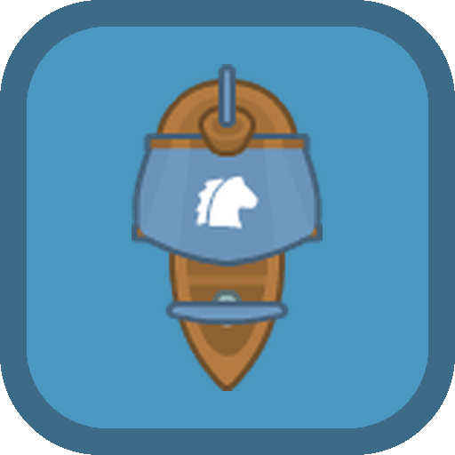

# 🏴‍☠️ Plunder Seas

A one-thumb, mobile-friendly **top-down naval combat roguelite**. Sail an
endless procedural archipelago, fight enemy ships with broadside cannons,
loot gold, upgrade your ship at the Quartermaster, and push deeper into
increasingly dangerous waters until the **Leviathan** rises.

Built with vanilla JavaScript + HTML5 Canvas — **no build step, no
dependencies** — and the [Kenney Pirate Pack](https://kenney.nl) (CC0) art.



## Play

It's a static site. Serve the folder over HTTP and open it:

```bash
# any static server works; ES modules require http(s), not file://
python3 -m http.server 8000
# then visit http://localhost:8000
```

On a phone, add it to your home screen — it's an installable **PWA** and
plays **offline** after the first load.

### Controls
- **Left thumb** — drag anywhere on the left half to steer & throttle (a
  floating joystick appears). Push toward where you want to sail.
- **Right thumb** — tap the right half (or the 💥 button) to fire the
  broadside facing the nearest enemy.
- **Mind the wind** — the compass (top-right) shows it. Sailing with the
  wind is faster; damaged sails slow you down.
- **Desktop** — WASD/arrows to steer, click or Space to fire, Esc to pause.

### The loop
1. **Sink ships** → they drop gold and the occasional cargo barrel.
2. **Spend gold** at the ⚓ Quartermaster (pause or anchor button) on hull,
   sails, cannons, crew, repairs, and ammo types.
3. **Retire** to bank a share of your gold as **doubloons**, or go down
   fighting — either way doubloons persist.
4. **Doubloons** unlock new ship classes (Frigate, Galleon), permanent
   perks, and ammo (Chain Shot, Grapeshot) in the **Shipyard**.

## Project structure

```
index.html              entry + PWA meta
manifest.webmanifest    installable app metadata
sw.js                   offline service worker
assets/                 Kenney Pirate Pack art (CC0) + generated icons
src/
  main.js               bootstrap, game loop, state machine, input dispatch
  core/                 math, rng, assets, audio (Web Audio synth), input, camera
  world/                procedural islands, tiles, wind
  entities/             ships (player+AI), projectiles, effects, pickups
  game/                 orchestration: spawns, zones, boss, combat, economy
  ui/                    ui toolkit, HUD, menus
  data/config.js        all gameplay tuning in one place
  save/save.js          localStorage meta-progression
GAME_PLAN.md            the design & build plan this was built from
```

All sound is **synthesized at runtime** via the Web Audio API — there are
no audio files.

## Deploy (GitHub Pages)

Push to GitHub, then in **Settings → Pages** choose *Deploy from a branch*
and select this branch with the `/ (root)` folder. The game is served as-is.

## Credits & license

- **Art:** Kenney "Pirate Pack" — [kenney.nl](https://kenney.nl) — CC0. See
  `assets/KENNEY_LICENSE.txt`.
- **Code:** this repository.
